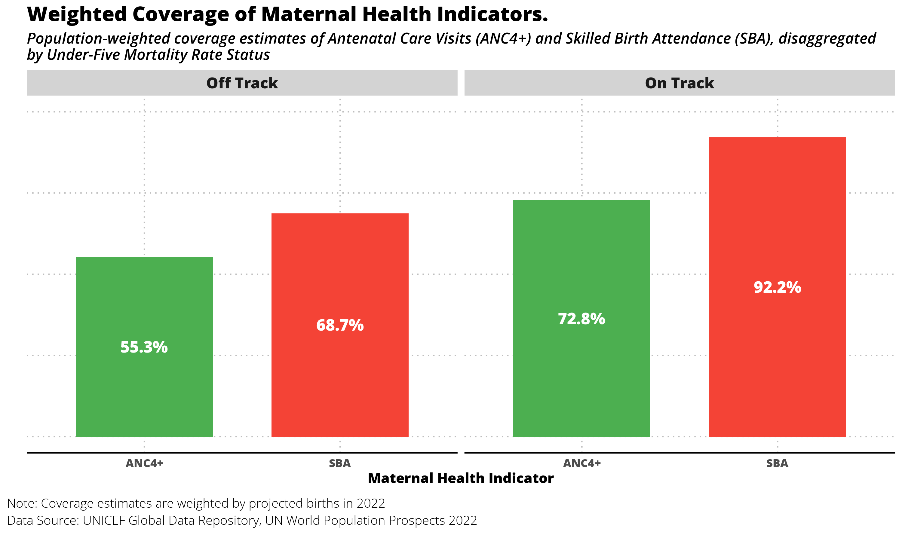

# Introduction

This report summarizes population-weighted coverage estimates of two essential maternal health indicators:

-   **ANC4+**: At least four antenatal care visits
-   **SBA**: Skilled birth attendance

Coverage is disaggregated by countries that are **on-track** or **off-track** in achieving under-five mortality targets as of 2022.

The analysis is based on the most recent data from 2018–2022, population projections for 2022, and mortality classifications.

# Methodology

## Data Sources

-   **ANC4 & SBA Coverage**: UNICEF Global Data Repository (2018–2022)
-   **Population (Projected Births 2022)**: UN World Population Prospects 2022
-   **Under-Five Mortality Status**: Provided classification list (on-track / off-track)

## Processing Steps

-   Selected the **most recent coverage estimate (2018–2022)** for each country.
-   Merged coverage data with under-five mortality classification.
-   Used **projected births in 2022** as weights to calculate population-weighted averages.
-   Produced disaggregated results by mortality status group.

## Weighted Coverage Formula

$$
\text{Weighted Coverage} = \frac{\sum_i (\text{coverage}_i \times \text{births}_i)}{\sum_i \text{births}_i}
$$

Where $i$ indexes countries within each group.

# Results

Countries classified as on track have significantly higher coverage for both indicators, with ANC4+ at **`r paste0(round(required_indicators %>% filter(status_u5mr == "On Track") %>% pull(weighted_ANC4)), "%")` and `r paste0(round(required_indicators %>% filter(status_u5mr == "On Track") %>% pull(weighted_SBA)), "%")`.** In contrast, off-track countries lag behind, with ANC4+ at **`r paste0(round(required_indicators %>% filter(status_u5mr == "Off Track") %>% pull(weighted_ANC4)), "%")` and `r paste0(round(required_indicators %>% filter(status_u5mr == "Off Track") %>% pull(weighted_SBA)), "%")`.** (see graph below). This suggests a clear association between stronger maternal health service coverage and better child survival outcomes, highlighting the need to prioritize investment in ANC and SBA services in countries that are off track in reducing under-five mortality.

```{r, fig.indicator_coverage_graph, fig.cap = "Coverage of indicators by U5MR status", echo=FALSE, message=FALSE, warning=FALSE}


```

# Positions Applied for

-   Administrative Data Analyst – Req. #581696
-   Household Survey Data Analyst Consultant – Req. #581656
